# BGE target list

This repository contains code to aggregate taxonomy, synonym, voucher, lab, and 
barcode metadata in a normalised relational model out of which reports can be 
extracted showing the current status of [BGE](https://biodiversitygenomics.eu/)'s 
barcoding activities. Coordinating this barcoding effort was a key impetus for the 
formation of [iBOL Europe](https://iboleurope.org/). Conversely, iBOL Europe seeks
to continue coordinating barcoding in Europe beyond BGE's sundown. Hence, one of the
applications of the functionality made available in this repository is to provide
structured reporting (i.e. a tabular view) that can be used to update iBOL Europe's
[target list web application](https://species.iboleurope.org).

## Overview of the process

1. [Create an empty SQLite database](src/util/bge_create_barcode_metadata_db.py).
   This database consists of six interrelated tables representing species, synonyms,
   higher taxonomic structure, specimens, barcodes, and barcode markers. Throughout
   this project's code, these tables are accessed and updated using object-relational
   mappings (ORM), thereby simplifying the code (which would otherwise mix Python and SQL,
   which is harder to maintain). The ORM classes are in [src/orm](src/orm)
2. [Import BGE's canonical target list names](src/util/bge_load_targetlist.py).
   In this step, the canonical names and their higher lineages are imported in the
   species and higher taxonomic structure tables. The input for this step is a 
   [manually curated version](https://github.com/bge-barcoding/gaplist-data/commits/main/data/Gap_list_all_updated.csv) 
   of Fabian Deister's name table. This curated version is located
   [here](https://github.com/bge-barcoding/gaplist-data/blob/main/data/Gap_list_all_updated.csv)
   in a different repository. Further improvements to this data set *must* take place
   in that repository, so that coding and taxonomic curation are separated.
3. [Import BGE's synonyms](src/util/bge_load_synonyms.py). Here, the synonyms are mapped
   against the canonical names and imported in the synonyms table. In this step, some
   further expansions are enacted. For example, for entries such as 
   *Genus (Subgenus) species*, the synonyms table will have this original entry, as well
   as *Genus species* and *Subgenus species*. The input data is from a 
   [manually curated](https://github.com/bge-barcoding/gaplist-data/commits/main/data/all_specs_and_syn.csv)
   version of Fabian Deister's synonyms list. This table is also kept in a separate repo
   for any further curation, located 
   [here](https://github.com/bge-barcoding/gaplist-data/blob/main/data/all_specs_and_syn.csv).
4. [Import BGE container data](src/util/bge_load_specimens.py). The BGE project has its 
   own, overarching [space](https://bench.boldsystems.org/index.php/MAS_Management_DataConsole?codes=BGE) 
   within the BOLD workbench. In that space, data exports can be produced showing the 
   status of the lab, specimen, voucher and taxonomy facets of the overall process under
   'Downloads > Data Spreadsheets'. Such exports should include all data and be in the
   'multi-sheet' format (i.e. not an Excel spreadsheet but a folder with TSV files).
   A snapshot of such an export in the data repo's
   [bold](https://github.com/bge-barcoding/gaplist-data/tree/main/data/bold) folder.
   When re-running the code presented here in order to reflect the current status, 
   a new download of the sheet data needs to be enacted as described above, and the
   TSV files then must be added to the bold folder, overwriting previous versions.
5. [Import public BOLD data](src/util/bge_load_bold.py). In this step, a public BOLD
   data package is imported in the database. The process checks to see if the encountered
   records aren't already imported from the lab sheets (same process ID), if they are the
   wanted marker (COI-5P), and if they match any of the synonyms. Then, a check is done
   to see if this isn't a record from an already known specimen (by way of the catalogue
   number). If that's the case, it's fine, but it means resequencing of the same specimen.
   If it's an unseen specimen, a new specimen is created in the database. Either way,
   a barcode record is created. Barcodes from the container are decorated with the `BGE`
   flag, others with the `BOLD` flag.

```mermaid
flowchart TD
    Start([Start Script]) --> CheckDir{Directory exists?}
    CheckDir -->|No| CreateDir[Create directory]
    CheckDir -->|Yes| CleanUp
    CreateDir --> CleanUp

    subgraph CleanUp[Clean Up]
        RemoveDB[Remove DB if exists]
        RemoveGaplist[Remove Gap list if exists]
        RemoveSynonyms[Remove Synonyms if exists]
        RemoveTaxonomy[Remove Taxonomy if exists]
        RemoveVoucher[Remove Voucher if exists]
        RemoveLab[Remove Lab if exists]
        RemoveAddendum[Remove Addendum if exists]
    end

    CleanUp --> CreateDB[Create database]
    CreateDB --> FetchTargetList[Fetch Gap list data]
    FetchTargetList --> LoadTargetList[Load Gap list data]

    LoadTargetList --> FetchSynonyms[Fetch synonyms data]
    FetchSynonyms --> LoadSynonyms[Load synonyms data]

    LoadSynonyms --> FetchTaxonomy[Fetch BOLD taxonomy data]
    FetchTaxonomy --> FetchVoucher[Fetch BOLD voucher data]
    FetchVoucher --> FetchLab[Fetch BOLD lab data]

    FetchLab --> LoadSpecimens[Load specimen data]
    LoadSpecimens --> FetchBold[Download BOLD data]
    FetchBold --> ExtractBold[Extract BOLD data]
    ExtractBold --> LoadBold[Load BOLD data]

    LoadBold --> End([End Script])

    class CreateDB,LoadTargetList,LoadSynonyms,LoadSpecimens,FetchBold,LoadBold pythonScript;
    class FetchTargetList,FetchSynonyms,FetchTaxonomy,FetchVoucher,FetchLab curlCommand;

    classDef pythonScript fill:#a2d2ff,stroke:#333,stroke-width:1px;
    classDef curlCommand fill:#ffafcc,stroke:#333,stroke-width:1px;
```



## Installation and usage

The scripts provided here have some Python dependencies. These are managed with a 
conda [dependencies.yaml](dependencies.yaml) and a pip 
[requirements.txt](requirements.txt). The general procedure is:

```{bash}
conda env create -f dependencies.yaml
conda activate target-list
```

*Note: this may require some cleaning up.* There are duplicates between the conda file
and the pip file. Also, the conda file is not executing the pip file. 

Next, the overall pipeline can be executed as:

```{bash}
./make_bge_db.sh
```

*Note: this shell script is provided as an example.* It could be improved upon, or it
could serve to instruct users how to execute the various steps described above manually.

## Next steps

The following steps are going to be necessary:

- Further curation of the input names list and synonyms list. During manual curation,
  syntax-level issues were resolved. These include removal of duplicate records, aligning
  the synonyms table with the names list's view on what is canonical versus synonymous,
  dealing with inconsistent text encoding (apparently a mix of latin-1 and unicode?).
  The overall structure of these files should stay as-is, because the current code is
  written around it.
- Further refinement of the database schema and ORM. At present, the schema and ORM
  exactly follow's ARISE's. This means there is some legacy in there. For example,
  the species and synonyms tables have the `nsr_` prefix, referring to the Dutch
  Species Register ("Nederlands Soortenregister"). The prefix has no function, but
  removing it must be done consistently across the code. Likewise, some columns are
  irrelevant (e.g. occurrence_status, which refers to a two-letter code in the NSR),
  while others are being abused to insert additional metadata. For example, specimen
  locality and barcode defline are used to insert the `BGE` and `BOLD` flags.
- Handling of the BOLD data package. We assume that BOLD's BCDM output is stable. This
  is not entirely certain (e.g. currently `None` is used for empty fields. This could
  change). Also, the processing is slow. It is possible that speed gains could be made
  by: skipping the ORM and doing SQL directly; optimising some of the SQLite pragmas;
  parallel processing of BCDM chunks in separate threads. None of these changes are
  trivial, however.
- Pipelining. A shell script is provided to document the processing steps. However, a
  more robust approach that involves better environment management and error handling
  would be welcome. E.g. a simple snakemake pipeline or something.

## Notice

This repository is provided as a proof of concept. The author rejects all responsibility
for support, maintenance, updates, new features, regular runs, and so on.

THE SOFTWARE IS PROVIDED "AS IS", WITHOUT WARRANTY OF ANY KIND, EXPRESS OR
IMPLIED, INCLUDING BUT NOT LIMITED TO THE WARRANTIES OF MERCHANTABILITY,
FITNESS FOR A PARTICULAR PURPOSE AND NONINFRINGEMENT. IN NO EVENT SHALL THE
AUTHORS OR COPYRIGHT HOLDERS BE LIABLE FOR ANY CLAIM, DAMAGES OR OTHER
LIABILITY, WHETHER IN AN ACTION OF CONTRACT, TORT OR OTHERWISE, ARISING FROM,
OUT OF OR IN CONNECTION WITH THE SOFTWARE OR THE USE OR OTHER DEALINGS IN THE
SOFTWARE.