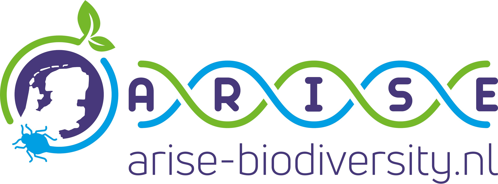

# Integrating public and private barcode data

This project aims to provide tooling for managing 
[ARISE](https://www.arise-biodiversity.nl/) DNA barcode metadata to achieve
the following:

✅ Ingest Dutch species registry 
   ([NSR](https://www.nederlandsesoorten.nl/content/toegang-tot-de-data)) taxonomy 
   as DarwinCore data.
   
✅ Ingest NSR synonyms from tab-separated tables

✅ Harvest remote data and metadata accessible through 
   [BOLD datapackage files](https://www.boldsystems.org/index.php/datapackages)
   
✅ Integrate data ([FASTA/BLAST DB](https://www.ncbi.nlm.nih.gov/books/NBK279690/))
   and metadata ([SQLite](https://www.sqlite.org/index.html)) to enrich sequence records
   
✅ Ingest on-disk, file-based data (FASTA) and metadata (CSV/TSV) managed 
   using [Geneious](https://www.geneious.com/) and Klasse.

⌛ Report and visualize gap analysis of database contents for targeted sequencing 
   
⌛ Filter candidate barcodes by flexible criteria, e.g. marker, provider, geographic origin

⏳ Navigate database contents in tabular form as web view and REST API 
   ([Django](https://www.djangoproject.com/))

## How to use

Consult the [doc](doc) folder for more info.

## Authors

Bastiaan Anker, Pierre-Etienne Cholley, Naomi van Es, Rutger Vos. 

(Feel free to add yourself here in any substantial pull requests.)

## License

This source code is made available under the [MIT License](LICENSE).
