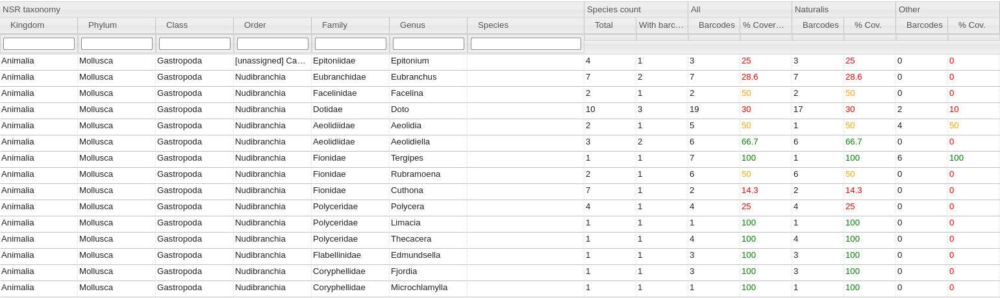

Target list interactive table powered by [SlickGrid](https://slickgrid.net/)




### How to access

2 options:
* Download the whole html folder on your disk and run the target_list.html file on your web browser.

   You may regenerate the HTML file with different database using:
   ```
   python src/arise/barcode/metadata/util/compute_barcode_coverage.py -db data/sqlite/arise-barcode-metadata.db 
   ```
* Access the target list table via the [gitlab page](https://arise-biodiversity.gitlab.io/sequencing/arise-barcode-metadata/)
   >The online page shows data of barcodes from all locations and for all markers.